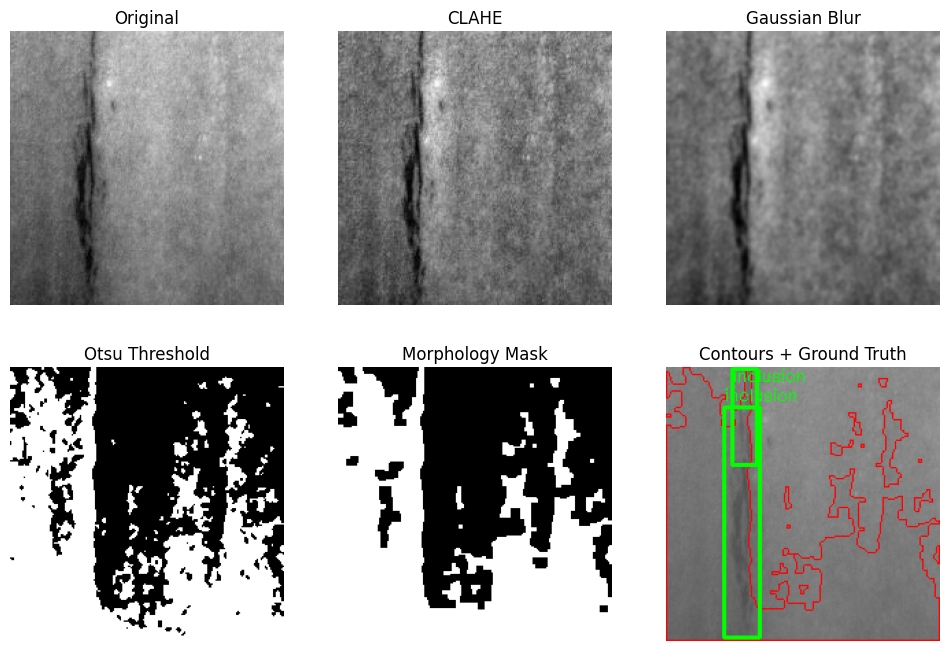
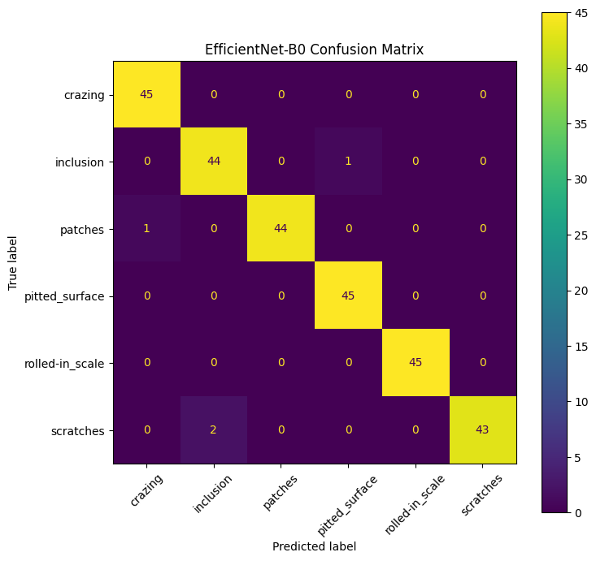

# Industrial Defect Detection using Computer Vision and Deep Learning

## Overview

This project presents an end-to-end industrial surface defect inspection pipeline using both classical computer vision techniques and deep learning models on the NEU-DET steel surface defect dataset.

The workflow covers:

- Image preprocessing
- Defect segmentation
- Feature extraction
- Defect classification
- Defect localization and object detection
- Quantitative performance evaluation

The project was implemented using Python, OpenCV, PyTorch, and YOLOv8.

---

## Dataset

**NEU-DET Surface Defect Dataset**

The dataset contains grayscale steel surface images with bounding box annotations in Pascal VOC XML format.

### Defect Classes

- Crazing
- Inclusion
- Patches
- Pitted Surface
- Rolled-in Scale
- Scratches

---

# Project Pipeline

```text
Input Image
     │
     ▼
OpenCV Preprocessing
     │
     ▼
Segmentation & Feature Extraction
     │
     ├────────────► EfficientNet-B0 Classification
     │
     └────────────► YOLOv8 Defect Localization
```

---

# Part 1: Classical Computer Vision Pipeline

## Image Preprocessing

Implemented preprocessing techniques to enhance industrial surface images:

- CLAHE (Contrast Limited Adaptive Histogram Equalization)
- Gaussian Blur
- Contrast Enhancement
- Noise Reduction

## Defect Segmentation

Defect regions were segmented using:

- Otsu Thresholding
- Morphological Opening
- Morphological Closing

## Feature Extraction

Contour-based geometric features were extracted from segmented defect regions:

- Area
- Perimeter
- Bounding Box Dimensions
- Aspect Ratio
- Circularity

### OpenCV Processing Pipeline



*Example of preprocessing, segmentation, contour detection, and feature extraction using OpenCV.*

---

# Part 2: Defect Classification

## Model

**EfficientNet-B0 (Transfer Learning)**

### Training Configuration

| Parameter | Value |
|------------|------------|
| Framework | PyTorch |
| Input Size | 224 × 224 |
| Optimizer | Adam |
| Loss Function | Cross Entropy Loss |
| Transfer Learning | Yes |
| Data Augmentation | Horizontal Flip, Rotation |

### Classification Results

| Metric | Value |
|------------|------------|
| Validation Accuracy | 98.52% |
| Test Accuracy | 98.52% |
| Macro Precision | 98.55% |
| Macro Recall | 98.52% |
| Macro F1-score | 98.52% |

### Per-Class Performance

| Class | Precision | Recall | F1-score |
|------------|------------|------------|------------|
| Crazing | 97.83% | 100.00% | 98.90% |
| Inclusion | 95.65% | 97.78% | 96.70% |
| Patches | 100.00% | 97.78% | 98.88% |
| Pitted Surface | 97.83% | 100.00% | 98.90% |
| Rolled-in Scale | 100.00% | 100.00% | 100.00% |
| Scratches | 100.00% | 95.56% | 97.73% |

### Confusion Matrix



*EfficientNet-B0 classification performance across six industrial defect categories.*

---

# Part 3: Defect Localization and Object Detection

## Model

**YOLOv8n**

### Tasks

- Defect Detection
- Defect Localization
- Bounding Box Prediction

### Detection Results

| Metric | Value |
|------------|------------|
| Precision | 69.75% |
| Recall | 71.81% |
| mAP@50 | 75.24% |
| mAP@50:95 | 44.33% |

### YOLOv8 Predictions


*Example defect localization results produced by YOLOv8.*

---

# Technologies Used

- Python
- OpenCV
- NumPy
- Pandas
- Matplotlib
- PyTorch
- TorchVision
- Ultralytics YOLOv8

---

# Project Structure

```text
Industrial-Defect-Detection/
│
├── 01_opencv_preprocessing_feature_extraction.ipynb
├── 02_defect_classification_efficientnet.ipynb
├── 03_defect_localization_yolov8.ipynb
│
├── models/
│   ├── efficientnet_b0_neu_classification.pt
│   └── yolov8n_neu_defect_best.pt
│
├── results/
│   ├── opencv_preprocessing_segmentation.png
│   ├── confusion_matrix.png
│   ├── yolo_pred_1.png
│   ├── yolo_pred_2.png
│   └── yolo_pred_3.png
│
└── README.md
```

---

# Key Achievements

- Developed an end-to-end industrial defect inspection pipeline using OpenCV, EfficientNet-B0, and YOLOv8.
- Implemented preprocessing, segmentation, feature extraction, classification, and localization workflows.
- Achieved **98.52% classification accuracy** on six industrial defect classes.
- Achieved **75.24% mAP@50** for defect localization using YOLOv8.
- Evaluated model performance using Accuracy, Precision, Recall, F1-score, Confusion Matrix, and mAP metrics.

---

# Skills Demonstrated

- Computer Vision
- Industrial Image Inspection
- Image Processing
- Image Segmentation
- Feature Extraction
- Deep Learning
- Transfer Learning
- Object Detection
- Defect Classification
- OpenCV
- PyTorch
- YOLOv8
- Model Evaluation
